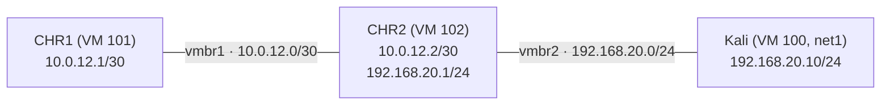

# MikroTik OSPF Network Lab on Proxmox

A hands-on ISP-style network lab built with MikroTik **CHR** (Cloud Hosted
Router, RouterOS v7) virtual machines on a home **Proxmox VE 9** server.
I built it to practise the skills an entry-level ISP Network Operations role
needs: Layer 2 / Layer 3, OSPF, BGP, network services (DNS, SNMP, NTP,
firewall), change management and config backups. I typed every command
myself and wrote down what each step does and why.

## Topology

```
[CHR1] ---vmbr1--- [CHR2] ---vmbr2--- [Kali]
10.0.12.1/30   10.0.12.2/30  192.168.20.1/24  192.168.20.10/24
(Later: CHR3 to form a triangle with redundant paths)
```



- `vmbr1` and `vmbr2` are **isolated** Linux bridges: no physical port and no
  host IP. Lab traffic cannot reach the home network or the internet.
- Kali keeps its normal NIC on `vmbr0` (home LAN) and gets a **second** NIC on
  `vmbr2` for the lab.

## Progress

| # | Milestone | Status | Notes |
|---|---|---|---|
| 1 | Proxmox setup: bridges, CHR VMs, attach Kali | ✅ Done | [docs/01-proxmox-setup.md](docs/01-proxmox-setup.md) |
| 2 | Addressing, ARP, L2 vs L3 | ✅ Done | [docs/02-addressing-arp.md](docs/02-addressing-arp.md) |
| 3 | Static route (then remove it) | ✅ Done | [docs/03-static-route.md](docs/03-static-route.md) |
| 4 | OSPF: area 0, neighbors, routes | ⬜ | |
| 5 | Failure test / reconvergence (CHR3) | ⬜ | |
| 6 | DNS, SNMP, NTP, firewall filter | ⬜ | |
| 7 | eBGP between AS 65001 and AS 65002 (stretch) | ⬜ | |
| 8 | Change management practice | ⬜ | [change-plans/](change-plans/) |
| 9 | Config backup script (bonus) | ⬜ | |

## Repository layout

| Path | Contents |
|---|---|
| `docs/` | Step-by-step notes per milestone: what, why, commands, verification |
| `docs/reference/` | Background facts checked against vendor docs |
| `change-plans/` | Change plans (purpose, steps, verification, rollback) |
| `configs/` | Sanitized RouterOS `/export` output (added later) |
| `verification/` | Key outputs: OSPF neighbors, routes, traceroute, snmpwalk (added later) |
| `scripts/` | Config backup script (added later) |

## Environment

- Proxmox VE 9.2 (Debian 13), single node
- MikroTik CHR, RouterOS v7 stable, free license (1 Mbit/s upload cap per
  interface, fine for a lab)
- Kali Linux VM as the LAN client and test box

## Public-safety rules for this repo

No passwords, tokens, public IPs, hostnames or domain names. Router exports
are sanitized before they are committed.

## What I learned / problems I solved

Kept up to date as the lab grows. Full details, including my mistakes and
what the error messages meant, are in each milestone's notes in `docs/`.

### Milestone 1: building the "physical" network

- A Linux bridge is a virtual **switch** (Layer 2): it learns MAC addresses
  and forwards Ethernet frames. Plugging two VMs into the same bridge *is*
  the cable between them.
- Lab bridges have no physical port and no host IP, so lab mistakes can't
  leak into the home network or cut off remote access.
- Mapped Proxmox NICs to RouterOS ports (`net0` → `ether1`, `net1` →
  `ether2`) and proved it by matching MAC addresses, instead of assuming.
- First thing on a new router: set the admin password and a clear identity,
  so you never type into the wrong router.

### Milestone 2: addressing, ARP, Layer 2 vs Layer 3

- **Subnetting:** `/30` for point-to-point router links (2 usable
  addresses), `/24` for a LAN, router on `.1` as the default gateway.
- **ARP** maps an IP address to a MAC address on the local link. IP decides
  *who* to send to, ARP finds *which MAC*, the switch delivers by MAC.
- Devices only talk directly inside **their own subnet**. Being in the same
  lab is not the same as being in the same network.
- **Longest prefix match:** when several routes match, the most specific
  wins. The default route (`/0`) is the last resort.
- Fixed a real side problem: adding a second NIC made Kali's main network
  profile attach to the wrong interface and drop its internet. Diagnosed it
  with `nmcli dev status` and locked the profile to its interface.

### Milestone 3: static routing and troubleshooting

- Routing is **hop-by-hop**: a route only points to the next router, and
  every router decides with its own table.
- Routing must work **in both directions**. Kali could reach CHR1, but CHR1
  had no route back, so the ping timed out. A missing return route looks
  exactly like total silence from the sender's side.
- **Error messages tell you where it failed:** "Network is unreachable" =
  no route on the sending device, the packet never left. A timeout = the
  packet left, but it was dropped on the way or the reply never came back.
- **TTL** drops by 1 at every router (64 → 63 = one router in between) and
  stops packets from looping forever. **Traceroute** uses it to list every
  router on the path.
- **Administrative distance:** connected 0, static 1, OSPF 110. Lower wins.
- Safe changes: delete routes by what they are (`[find dst-address=…]`),
  never by row number, which can change between commands.

## Skills this lab covers for an ISP Network Operations role

| NOC task | What I practised here | Status |
|---|---|---|
| Read and explain a routing table | RouterOS `/ip route print`, Linux `ip route`, flags, distance | ✅ |
| Subnetting and addressing plans | `/30` links, `/24` LAN, network/broadcast addresses | ✅ |
| Layer 2 vs Layer 3 troubleshooting | Bridges, MAC matching, ARP tables, link flags | ✅ |
| First-line fault isolation | ping, traceroute, "unreachable" vs timeout, return-path checks | ✅ |
| Static routing | Add, verify, remove safely | ✅ |
| Working on the CLI of two systems | MikroTik RouterOS v7 and Linux (`ip`, `nmcli`) | ✅ |
| Dynamic routing (OSPF) | Neighbors, LSAs, route propagation | Next |
| Failure and reconvergence | Third router, break a link, watch OSPF reroute | Planned |
| Core network services | DNS, SNMP monitoring, NTP, firewall filters | Planned |
| BGP between networks | eBGP between AS 65001 and AS 65002 | Planned |
| Change management | Written change plans with verification and rollback | Planned |
| Config backups and automation | `/export` backup script | Planned |
