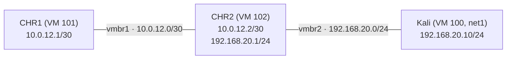

# MikroTik OSPF Network Lab on Proxmox

A hands-on ISP-style network lab built with MikroTik **CHR** (Cloud Hosted
Router, RouterOS v7) virtual machines on a home **Proxmox VE 9** server.
I built it to practise the skills an entry-level ISP Network Operations role
needs: Layer 2 / Layer 3, OSPF, BGP, network services (DNS, SNMP, NTP,
firewall), change management and config backups. I typed every command
myself and wrote down what each step does and why.

## Topology

```
[CHR1] ---vmbr1--- [CHR2] ---vmbr2--- [Kali]
10.0.12.1/30   10.0.12.2/30  192.168.20.1/24  192.168.20.10/24
(Later: CHR3 to form a triangle with redundant paths)
```



- `vmbr1` and `vmbr2` are **isolated** Linux bridges: no physical port and no
  host IP. Lab traffic cannot reach the home network or the internet.
- Kali keeps its normal NIC on `vmbr0` (home LAN) and gets a **second** NIC on
  `vmbr2` for the lab.

## Progress

| # | Milestone | Status | Notes |
|---|---|---|---|
| 1 | Proxmox setup: bridges, CHR VMs, attach Kali | 🟡 In progress | [docs/01-proxmox-setup.md](docs/01-proxmox-setup.md) |
| 2 | Addressing, ARP, L2 vs L3 | ⬜ | |
| 3 | Static route (then remove it) | ⬜ | |
| 4 | OSPF: area 0, neighbors, routes | ⬜ | |
| 5 | Failure test / reconvergence (CHR3) | ⬜ | |
| 6 | DNS, SNMP, NTP, firewall filter | ⬜ | |
| 7 | eBGP between AS 65001 and AS 65002 (stretch) | ⬜ | |
| 8 | Change management practice | ⬜ | [change-plans/](change-plans/) |
| 9 | Config backup script (bonus) | ⬜ | |

## Repository layout

| Path | Contents |
|---|---|
| `docs/` | Step-by-step notes per milestone: what, why, commands, verification |
| `docs/reference/` | Background facts checked against vendor docs |
| `change-plans/` | Change plans (purpose, steps, verification, rollback) |
| `configs/` | Sanitized RouterOS `/export` output (added later) |
| `verification/` | Key outputs: OSPF neighbors, routes, traceroute, snmpwalk (added later) |
| `scripts/` | Config backup script (added later) |

## Environment

- Proxmox VE 9.2 (Debian 13), single node
- MikroTik CHR, RouterOS v7 stable, free license (1 Mbit/s upload cap per
  interface, fine for a lab)
- Kali Linux VM as the LAN client and test box

## Public-safety rules for this repo

No passwords, tokens, public IPs, hostnames or domain names. Router exports
are sanitized before they are committed.

## What I learned / problems I solved

Kept up to date as the lab grows. See each milestone's notes in `docs/`.
